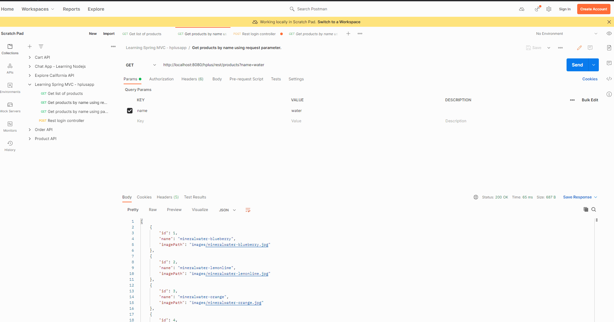

# Spring: Spring MVC

## Overview

Welcome to one of my practice repositories where I study and share my findings about Spring Boot and Spring MVC. The base code of this repo is from a LinkedIn Learning course titled [Spring: Spring MVC](https://www.linkedin.com/learning/spring-spring-mvc-2/spring-mvc-for-robust-applications?contextUrn=urn%3Ali%3AlyndaLearningPath%3A5b101b04498e06fb6e2d8785&resume=false&u=78163626). The author of the course is Ketkee Aryamane. 

Part of my studies involves following online tutorials and courses, that I think I will find useful to learn from. 
I find these kind of study materials useful, especially when it involves some new programming frameworks like Spring. 
Before I jump into building bigger projects, I always like to go over easier demos to get a better feeling of what the framework is offering. 
Ketkee Aryamane's course is a great example of that kind of educational content. It offers a great overview of Spring MVC. For this course she prepared a great demo project that is helpful when trying to learn what are the building block of a Spring MVC web application. 
You can read my full review of the Spring: Spring MVC here on my [blog](https://medium.com/@gregoryszy/my-review-of-spring-spring-mvc-fb48077c7cb0) on Medium. 

Over time I like to come back to these examples and do additional modifications. You will also see a lot of additional comments over the code. That is my way of taking notes, so I can solidify my understanding about what a specific line of code does and how does it relate to the whole project. Spring MVC has a lot to offer so I will treat this repository  as a playground where I can test new and old Spring MVC features, learn more about how to properly use Github and practice my writing skills. 

## Key Topics

Below are the topics that I have learned from following the Spring: Spring MVC course and reviewing it's coding examples. Below are also included questions that the course helped me answer:

* Spring MVC Features and Architecture
  * What can we use Spring MVC for?
  * How do Spring MVC projects work?
  * What is the required setup for a Spring MVC project? 
* Spring MVC Controllers Flow
  * What is the role of a controller?
  * How can we pass data from and to views? 
* Data Validation
  * How can we utilize Spring Validators to define and use validation rules?
  * How can we use Spring tags to display errors related to validation? 
  * Gow can we use Binders to convert strings into other datatypes? 
  * How are Convertors different from Binders? 
* Exception Handling
  * How can we add custom error pages to a Spring MVC application?
  * What is trhe role of exception handlers and how to implement them? 
* Asynchronous Request Processing
  * What is the difference between a conventional HTTP request and a request that using asunc processing? 
  * What is required configuration for async processing in a Spring MVC application?
* View Resolvers
  * What are view resolvers?
  * What type of view resolvers exist in Spring MVC?
  * How can we implement different view resolvers in a Spring MVC application?
  * What is view resolver chaining? 
* Interceptors and Themes
 * How can we manipulate requests using interceptors? 
 * How are themes used to modify the look and feel of views?
 * How can website localization be implemented in Spring MVC? 
* Spring MVC REST Controllers
 * How are REST Spring MVC controllers different from regular Spring MVC controllers? 

## Video Walkthroughs

### Hplusapp Walkthrough

Below is a video walkthrough of the final web application that a listener can develop while following the guidance from the Spring: Spring MVC course. In the video you can see that multiple example features were added to the application. Those include retrieving product information from a database, creating new users and saving them in the database, using user information to log in, input validation, page redirection, errror handling through error pages and more.  

 
### Rest Controllers Walkthrough Using Postman

In one of the latter parts of the course, one chapter covers how you can use Spring MVC to create a RESTFul service.
The video below demonstrates how some implemented rest endpoints work in Postman. In the video we can see two examples of a GET request to retrieve the list of products by a provided name.
The difference between those two request is that one the first case a request parameter is used to pass a string by which the product list will be found.
In the second case a path variable is utilized to perform the same type of search. After the product search, a demo of the login rest controller is performed.
The endpoint that handles the login returns a different response depending on the username and password of the login object that is passed into the request. 

## Links

This repository is based on the materials covered in:
[LinkedIn Learning - Spring: Spring MVC](https://www.linkedin.com/learning/spring-spring-mvc-2/spring-mvc-for-robust-applications?autoplay=true&contextUrn=urn%3Ali%3AlyndaLearningPath%3A5b101b04498e06fb6e2d8785&resume=false&u=78163626) 
